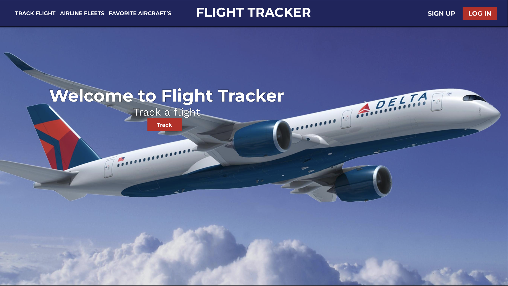
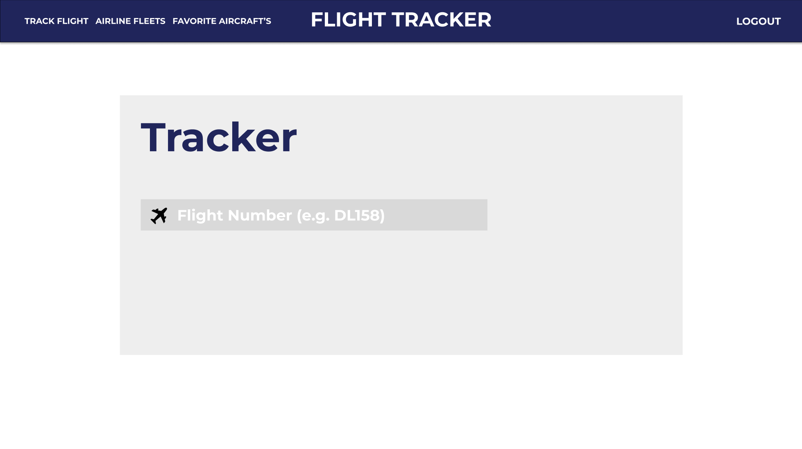
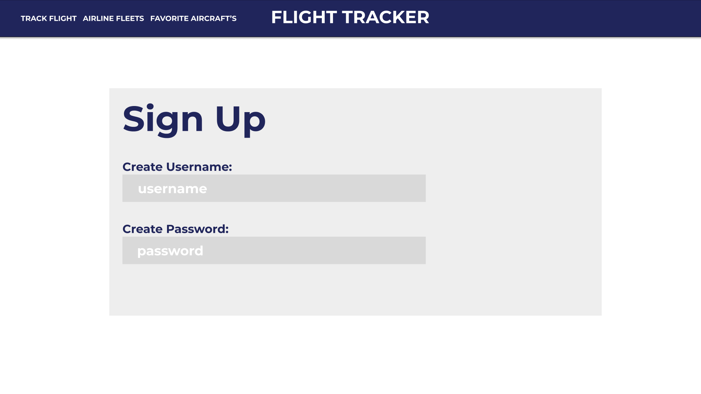
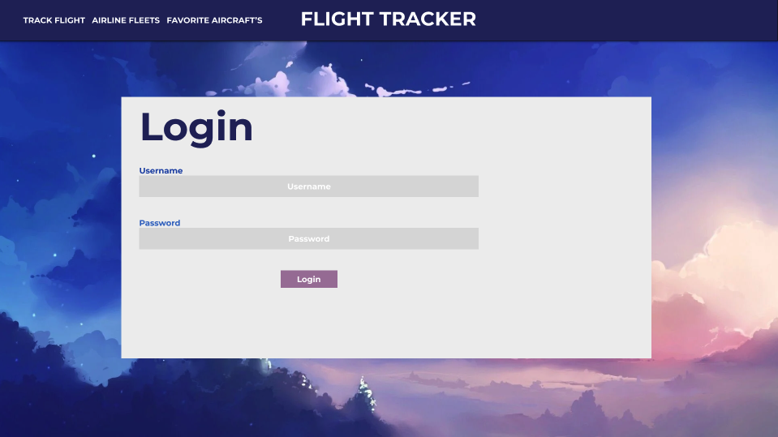
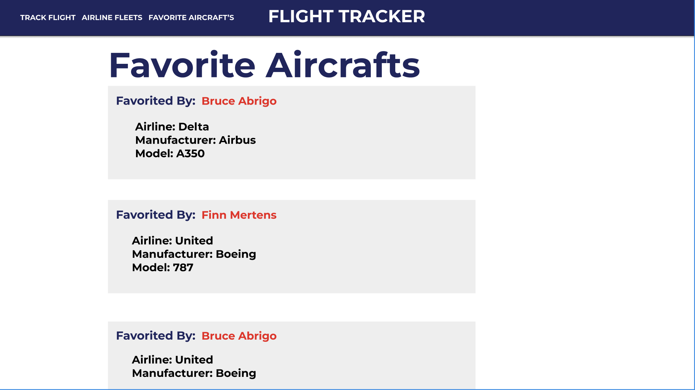
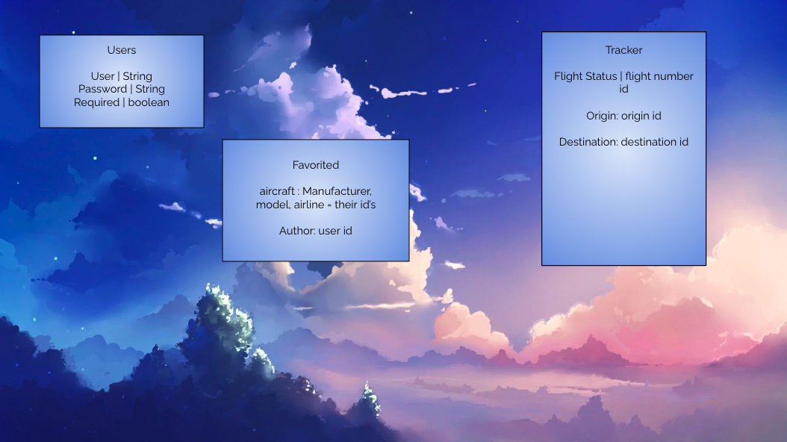

# NeatAir-FullStack-App
Neat Airlines Web Application



Flight Tracker emphasizes my interest in aviation. This Full Stack Application allows for the tracking of flights (via Flight Number), and user functionality to browse airline fleets, and choose favorite crafts from airline fleets.

# Technologies Used
Javascript, HTML, CSS, LIQUID, and MONGOOSE

# User Story
- User should be able to track a flight (via flight number)
- User should be able to view Airline aircraft fleets
- User should be able to create an account
- User should be able to Log In
- User should be able to Input favorite Airline (livery), Aircraft Manufacturer and model
- User should be able to access favorited aircrafts by additional users

# Wireframes

Tracker Page



Sign Up



Log In



Favorites



# Route Tables

Favorited Planes

| **URL**          | **HTTP Verb**|**Action**|
|---------------------|--------------|----------|
| /airplanes/         | GET          | index  
| /airplanes/new      | GET          | show       
| /airplanes/new      | GET          | new   
| /airplanes          | POST         | create   
| /airplanes/:id/edit | GET          | edit       
| /airplanes/:id      | PUT          | update    
| /airplanes/:id      | DELETE       | destroy  

Flight Tracker

| **URL**          | **HTTP Verb**|**Action**|
|-----------------------|--------------|----------|
| /tracker/             | GET          | new  
| /tracker/history      | GET          | show  

Users       

| **URL**          | **HTTP Verb**|**Action**|
|-----------------------|--------------|----------|
| /users/signup         | GET          | new  
| /users/signup         | POST         | create   
| /users/login          | GET          | login  
| /users/login          | POST         | create  
| /users/logout         | DELETE       | destroy

# Model Samples

| ** Users ** |
| ----------- |
```
/* --- These will contain Flight Tracker User Schemas */
const userSchema = new Schema ({
  username: {
    type: String to contain client username input,
    required: boolean to require a username input,
    unique: must ensure usernames cannot be duplicated
  },
  password: {
    type: String to contain client password input,
    required: boolean to require a password input
  }
})

```

# Request from a flight tracker API

Our flight tracker API will send a request to Aviationstack

GET router to SHOW tracker page

```
router.get('http to tracker page', (req, res) =>  {
  <render to a new tracker page>
})

router.post()
 <to actually request aviationstack models>
```

# ERD

